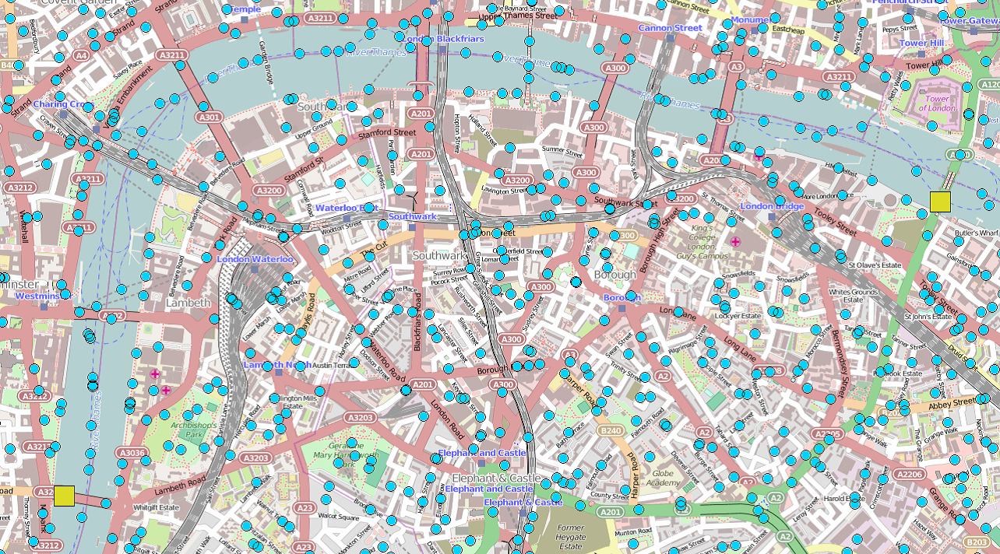

When two people want to meet up at a large event, they may be hampered when a pre-arranged rendezvous point turns out to be inconvenient, while any centralized services for real-time coordination are overwhelmed by demand. Peer-to-peer calculations between participating devices could guide the two friends to meet at an intermediate location, regardless of the continued movement of the two friends and participating devices in the area.

Code samples and illustrations from a simulation:
- Using some of Protelis’s special operators (purple), a small number of functions (blue) and be defined and applied to variables (green), “Alice” and “Bob” can be directed toward each other (red dots) through the peer-to-peer calculations performed on participating devices (blue dots). 
- distanceTo
- descend
- rendezvous 

 
 
Imagine an initial configuration where a number of individuals carrying participating devices (blue dots) are attending a large event, and two of them wish to meet up.
